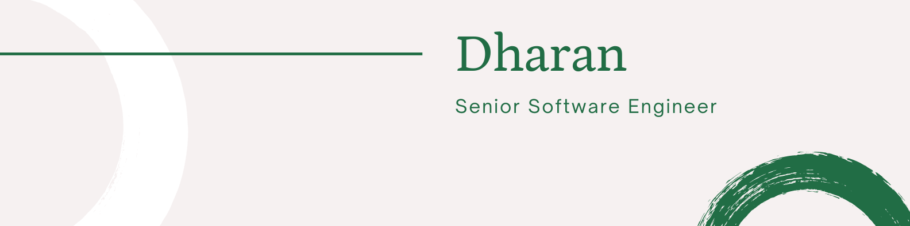

### A little more about me...

```javascript
  const DHARAN_GANESAN = {
    code: [Javascript, Typescript, HTML, CSS],
    tools: [React, Node, Angular, Sass, ...[Exploring new things]],
  }
```

- 💌 **Let's Collaborate**: Feel free to reach out for collaboration opportunities or inquiries.
- 📫 How to reach me: &nbsp; [](https://www.linkedin.com/in/dharan-ganesan)
[](https://topmate.io/dharan_ganesan) [](https://calendly.com/dharang/15min)

Let's build something amazing together! 🚀

---

# 📚 Blog posts
Here are a few recent blog posts of mine:

<!-- BLOG-POST-LIST:START -->
- [Day 67: Tooltip](https://dev.to/dhrn/day-67-css-only-tooltip-30b6)
- [Day 66: Document Object Model](https://dev.to/dhrn/day-66-document-object-model-38ha)
- [Day 65: Responsive Design](https://dev.to/dhrn/day-65-responsive-design-3i7o)
- [Day 64: CSS layouts](https://dev.to/dhrn/day-64-css-layouts-3c1i)
- [Day 63: CSS](https://dev.to/dhrn/day-63-css-og2)
<!-- BLOG-POST-LIST:END -->


📖 You can read more blog posts on my [dev.to](https://dev.to/dhrn) profile.
---

<details>
  <summary>🔥 My Stats</summary>

[](https://git.io/streak-stats)

[](https://github.com/anuraghazra/github-readme-stats)

</details>
