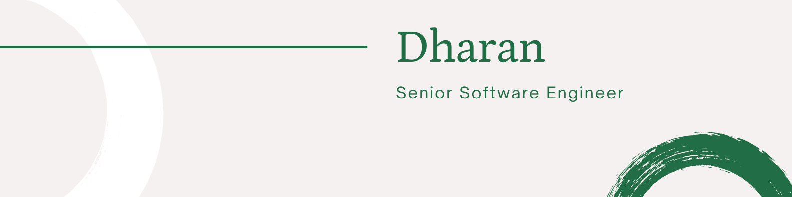

### A little more about me...

```javascript
  const DHARAN_GANESAN = {
    code: [Javascript, Typescript, HTML, CSS],
    tools: [React, Node, Angular, Sass, ...[Exploring new things]],
  }
```

- 💌 **Let's Collaborate**: Feel free to reach out for collaboration opportunities or inquiries.
- 📫 How to reach me: &nbsp; [](https://www.linkedin.com/in/dharan-ganesan)
[](https://topmate.io/dharan_ganesan) [](https://calendly.com/dharang/15min)

Let's build something amazing together! 🚀

---

# 📚 Blog posts
Here are a few recent blog posts of mine:

<!-- BLOG-POST-LIST:START -->
- [We Needed to Send Invoices as PDFs. Here&#39;s How We Solved It.](https://dev.to/dhrn/we-needed-to-send-invoices-as-pdfs-heres-how-we-solved-it-oje)
- [The Untold Story of Comet Browser](https://dev.to/dhrn/the-untold-story-of-comet-browser-1k3e)
- [🛠️ Browser Extensions](https://dev.to/dhrn/browser-extensions-4oac)
- [Day 100: Last Day](https://dev.to/dhrn/day-100-last-day-11k2)
- [Day 99: Match Pair](https://dev.to/dhrn/day-98-match-pair-1j1)
<!-- BLOG-POST-LIST:END -->


📖 You can read more blog posts on my [dev.to](https://dev.to/dhrn) profile.
---

<details>
  <summary>🔥 My Stats</summary>

[](https://git.io/streak-stats)

[](https://github.com/anuraghazra/github-readme-stats)

</details>
